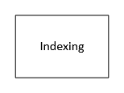
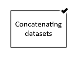
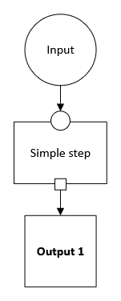
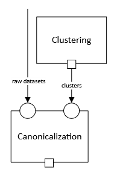
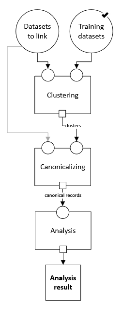
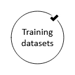

.. _pipeline_schema:

Pipeline Schema
===============

.. contents::
   :depth: 2
   :local:

Motivation
----------

Imagine the Census Bureau has an entity resolution pipeline that links people between datasets.
One step in this pipeline, called "blocking," categorizes records into "blocks"
in order to focus only on the pairs of records that might really be links.
The current pipeline uses a simple blocking mechanism,
which won't compare two records unless they match exactly on any of a few key attributes.
Census wants to explore whether using more sophisticated blocking methods would improve results,
without changing anything else in the pipeline.

Currently, software for entity resolution is mostly created by researchers.
Each researcher uses the technologies familiar to them and frames the entity resolution task
in the way that is most natural for their own examples,
making it hard to use multiple software modules together.
As a result, trying a new blocking method is too expensive for the Census Bureau
to undertake without knowing what the benefit will be.

Introduction
------------

**EasyLink** is a tool for creating entity resolution pipelines
by chaining together existing pieces of software.

It doesn't allow making pipelines arbitrarily by chaining together whatever software you want however you want,
and this is actually the key value proposition of EasyLink.
To be used in pipelines created with EasyLink, software modules must follow standard patterns.
These standards (including standard data formats) allow a single piece of software
to be used for the same conceptual task in any entity resolution pipeline.

We define our standards via the *pipeline schema*, which is described on this page.
The design goals of the pipeline schema are to be:

- **Flexible** enough to capture current entity resolution methods and new methods that are yet to be developed.
  In particular, we want to avoid a small innovation in one part of a pipeline causing that entire pipeline
  to become impossible to construct with EasyLink—*"bend, don't break."*
- **Detailed/standardized** enough in capturing current entity resolution methods,
  and areas of active methodological research, to allow very fine-grained experiments and interoperability.

Our pipeline schema can also be viewed as a restricted (but still very large) space of possible pipelines.
That is, there are certain pipelines EasyLink does not allow because they do not conform to our standards,
and the pipeline schema tells EasyLink how to check whether a pipeline is or isn't allowed.

Concepts
--------

Implementations
^^^^^^^^^^^^^^^

An **implementation** is a software module that performs
some part of the entity resolution task.
Since EasyLink needs to support software modules
built with a wide variety of technologies,
an implementation in EasyLink is made up of:

1. A `Singularity <https://en.wikipedia.org/wiki/Singularity_(software)>`_ container which contains all the code and dependencies
   required to run the software module.
2. Some additional metadata.

Executing the Singularity container runs the software.

Steps
^^^^^

A **step** is a task, a semantic unit of processing such as "indexing,"
which is when candidate record pairs for further processing
are selected out of the space of all possible pairs.
(This is closely related to blocking, in ways that will become clear later in this document.)
A step is abstract, not tied to a specific algorithm to achieve the task;
therefore, a step can be performed by many different implementations.

We draw a step as a box and label it with its name:

Default Implementations
^^^^^^^^^^^^^^^^^^^^^^^

A step with a check mark on its top right corner has a default implementation.
Therefore, the user doesn't *have* to specify anything.
If the user wants to, they can override the default implementation.

This is useful because some steps in the record linkage process
are quite straightforward and unlikely to be sites of innovation.
Default implementations for these allow EasyLink users
to focus on the more interesting steps
without taking away any flexibility—
if there is some unexpected need to use new implementations
for these less-interesting steps, the user can do that.

Slots
^^^^^

A **slot** is a semantic type of data that a step either receives or produces.

For example, consider "canonicalization,"
which is a step in record linkage that produces a "canonical" record for each entity (e.g., each person).
An implementation of this step might contain a specific algorithm
for choosing which of the first names
a person reported in different datasets to use in that person's canonical record.
This step needs to receive two types of input:
clusters of record IDs that correspond to the same entity,
and the full datasets (from before linking) to pull possible values from.
These two types of input are not interchangeable—
any implementation of the step needs to know which is which.
Therefore, they go in different labeled slots.

We draw **input slots** (slots for receiving data) as small circles
on the border of a step.
We draw **output slots** (slots for producing data) as small squares
on the border of a step.
A step may have multiple of either or both.

A **data specification** is a set of rules that data can be validated against.
Every slot is associated with a data specification
that any data passing through it must follow.
It isn't enough to *say* that a particular dataset is "clusters of record IDs"—
it has to actually *look* how we would expect those to look.
This could include constraints like having a specific tabular schema,
uniqueness in certain fields, etc.
For example, "clusters of record IDs to canonicalize" might entail
having two columns, :code:`record_id` and :code:`cluster_id`,
and :code:`record_id` must be unique.

The label on the arrow (e.g., "raw datasets" or "clusters") indicates the data specification
that the data must follow (this label is implicitly applied to any slots it is connected to).
The actual description of the data specification is not included in the diagram;
that will be listed in text below it.

Though we may expand this in the future,
we currently think of data in terms of *files or directories*.
Directories may be nested.
Here are some example specifications:

- A single file in a tabular format with columns A, B, and C.
- A directory containing three files,
  where each is in a tabular format and has three columns.
- A directory containing any number of subdirectories.
  Each subdirectory must contain two files, where each is
  in a tabular format.

Data specifications are enforced by EasyLink;
a pipeline will fail if any data do not follow their specification.

Data Dependencies
^^^^^^^^^^^^^^^^^

We connect an output slot to an input slot with an arrow, as shown below,
when the output of one step becomes the input to another.

.. note::

   There cannot be loops/cycles of data dependency (e.g., A -> B -> A),
   as then there would be no possible order to run the steps in --
   you couldn't run A until you had B's output,
   but couldn't run B until you had A's output!

Pipeline Schema
^^^^^^^^^^^^^^^

A basic **pipeline schema** is a set of steps interconnected by data dependencies
that additionally has input data nodes (large circles)
and output data nodes (large squares with bold text).

This is a **graph** `in the computer science/mathematical sense <https://en.wikipedia.org/wiki/Graph_(abstract_data_type)>`_.
More specifically, it is a **directed** (arrows have a direction)
**acyclic** (no arrow loops as discussed in the previous section)
**graph** (**DAG**).

The text labels in input and output nodes,
like the labels on dependency arrows,
indicate data specifications the input/output data must follow
(they implicitly label the slots they are connected to by dependency arrows.)

Data for the input nodes of the pipeline schema are provided directly by the user.
An input node can have a check mark on it to indicate that it has a default:

Such an input can be omitted by the user,
in which case the default value/dataset is used.
This is useful, for example,
when it would be common for the user not to have any data for that input:
rather than having to manually make a data frame with zero rows and pass it in,
they can simply omit it from their configuration.

However, a pipeline schema can contain more than just input, output, steps, and dependencies.
It can have some additional tricks, which we call **operators**.
These allow a pipeline schema to be more flexible
and contain patterns that the user (or EasyLink itself)
can customize to change the shape of the graph
before selecting implementations.
These operators are the subject of the next section.

Operators
---------

.. todo::

   This section.