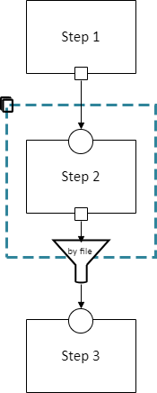
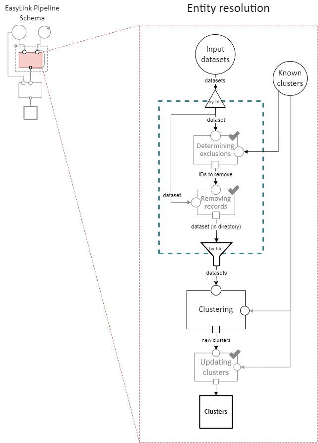
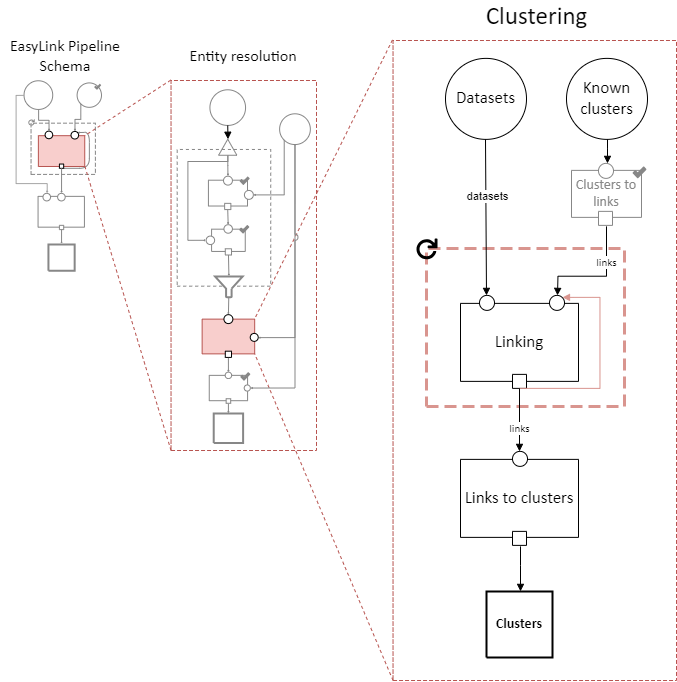

.. _pipeline_schema:

Pipeline Schema
===============

.. contents::
   :depth: 2
   :local:

Motivation
----------

Imagine the Census Bureau has an entity resolution pipeline that links people between datasets.
One step in this pipeline, called "blocking," categorizes records into "blocks"
in order to focus only on the pairs of records that might really be links.
The current pipeline uses a simple blocking mechanism,
which won't compare two records unless they match exactly on any of a few key attributes.
Census wants to explore whether using more sophisticated blocking methods would improve results,
without changing anything else in the pipeline.

Currently, software for entity resolution is mostly created by researchers.
Each researcher uses the technologies familiar to them and frames the entity resolution task
in the way that is most natural for their own examples,
making it hard to use multiple software modules together.
As a result, trying a new blocking method is too expensive for the Census Bureau
to undertake without knowing what the benefit will be.

Introduction
------------

**EasyLink** is a tool for creating entity resolution pipelines
by chaining together existing pieces of software.

It doesn't allow making pipelines arbitrarily by chaining together whatever software you want however you want,
and this is actually the key value proposition of EasyLink.
To be used in pipelines created with EasyLink, software modules must follow standard patterns.
These standards (including standard data formats) allow a single piece of software
to be used for the same conceptual task in any entity resolution pipeline.

We define our standards via the *pipeline schema*, which is described on this page.
The design goals of the pipeline schema are to be:

- **Flexible** enough to capture current entity resolution methods and new methods that are yet to be developed.
  In particular, we want to avoid a small innovation in one part of a pipeline causing that entire pipeline
  to become impossible to construct with EasyLink—*"bend, don't break."*
- **Detailed/standardized** enough in capturing current entity resolution methods,
  and areas of active methodological research, to allow very fine-grained experiments and interoperability.

Our pipeline schema can also be viewed as a restricted (but still very large) space of possible pipelines.
That is, there are certain pipelines EasyLink does not allow because they do not conform to our standards,
and the pipeline schema tells EasyLink how to check whether a pipeline is or isn't allowed.

Concepts
--------

Implementations
^^^^^^^^^^^^^^^

An **implementation** is a software module that performs
some part of the entity resolution task.
Since EasyLink needs to support software modules
built with a wide variety of technologies,
an implementation in EasyLink is made up of:

1. A `Singularity <https://en.wikipedia.org/wiki/Singularity_(software)>`_ container which contains all the code and dependencies
   required to run the software module.
2. Some additional metadata.

Executing the Singularity container runs the software.

Steps
^^^^^

A **step** is a task, a semantic unit of processing such as "indexing,"
which is when candidate record pairs for further processing
are selected out of the space of all possible pairs.
(This is closely related to blocking, in ways that will become clear later in this document.)
A step is abstract, not tied to a specific algorithm to achieve the task;
therefore, a step can be performed by many different implementations.

We draw a step as a box and label it with its name:

Default Implementations
^^^^^^^^^^^^^^^^^^^^^^^

A step with a check mark on its top right corner has a default implementation.
Therefore, the user doesn't *have* to specify anything.
If the user wants to, they can override the default implementation.
We draw these steps in gray.

This is useful because some steps in the record linkage process
are quite straightforward and unlikely to be sites of innovation.
Default implementations for these allow EasyLink users
to focus on the more interesting steps
without taking away any flexibility—
if there is some unexpected need to use new implementations
for these less-interesting steps, the user can do that.

Slots
^^^^^

A **slot** is a semantic type of data that a step either receives or produces.

For example, consider "canonicalization,"
which is a step in record linkage that produces a "canonical" record for each entity (e.g., each person).
An implementation of this step might contain a specific algorithm
for choosing which of the first names
a person reported in different datasets to use in that person's canonical record.
This step needs to receive two types of input:
clusters of record IDs that correspond to the same entity,
and the full datasets (from before linking) to pull possible values from.
These two types of input are not interchangeable—
any implementation of the step needs to know which is which.
Therefore, they go in different labeled slots.

We draw **input slots** (slots for receiving data) as small circles
on the border of a step.
We draw **output slots** (slots for producing data) as small squares
on the border of a step.
A step may have multiple of either or both.

.. image:: images/03_slots.drawio.png
   :alt: Diagram showing slots on a step

A **data specification** is a set of rules that data can be validated against.
Every slot is associated with a data specification
that any data passing through it must follow.
It isn't enough to *say* that a particular dataset is "clusters of record IDs"—
it has to actually *look* how we would expect those to look.
This could include constraints like having a specific tabular schema,
uniqueness in certain fields, etc.
For example, "clusters of record IDs to canonicalize" might entail
having two columns, :code:`record_id` and :code:`cluster_id`,
and :code:`record_id` must be unique.

The label on the arrow (e.g., "raw datasets" or "clusters") indicates the data specification
that the data must follow (this label is implicitly applied to any slots it is connected to).
The actual description of the data specification is not included in the diagram;
that will be listed in text below it.

Though we may expand this in the future,
we currently think of data in terms of *files or directories*.
Directories may be nested.
Here are some random examples of how data specifications could look,
to show the breadth of possible specifications:

- "A single file in a tabular format with columns A, B, and C."
- "A directory containing three files,
  where each is in a tabular format and has three columns."
- "A directory containing any number of subdirectories.
  Each subdirectory must contain two files, where each is
  in a tabular format."

Data specifications are enforced by EasyLink;
a pipeline will fail if any data do not follow their specification.

Data Dependencies
^^^^^^^^^^^^^^^^^

We connect an output slot to an input slot with an arrow, as shown below,
when the output of one step becomes the input to another.

.. note::

   There cannot be loops/cycles of data dependency (e.g., A -> B -> A),
   as then there would be no possible order to run the steps in --
   you couldn't run A until you had B's output,
   but couldn't run B until you had A's output!

Pipeline Schema
^^^^^^^^^^^^^^^

A basic **pipeline schema** is a set of steps interconnected by data dependencies
that additionally has input data nodes (large circles)
and output data nodes (large squares with bold text).

This is a **graph** `in the computer science/mathematical sense <https://en.wikipedia.org/wiki/Graph_(abstract_data_type)>`_.
More specifically, it is a **directed** (arrows have a direction)
**acyclic** (no arrow loops as discussed in the previous section)
**graph** (**DAG**).

The text labels in input and output nodes,
like the labels on dependency arrows,
indicate data specifications the input/output data must follow
(they implicitly label the slots they are connected to by dependency arrows.)

Data for the input nodes of the pipeline schema are provided directly by the user.
An input node can have a check mark on it to indicate that it has a default:

Such an input can be omitted by the user,
in which case the default value/dataset is used.
This is useful, for example,
when it would be common for the user not to have any data for that input:
rather than having to manually make a data frame with zero rows and pass it in,
they can simply omit it from their configuration.

However, a pipeline schema can contain more than just input, output, steps, and dependencies.
It can have some additional tricks, which we call **operators**.
These allow a pipeline schema to be more flexible
and contain patterns that the user (or EasyLink itself)
can customize to change the shape of the graph
before selecting implementations.
These operators are the subject of the next section.

Operators
---------

.. todo::

   Consider replacing the examples in this section with extracts from the record linkage
   pipeline schema, as in the previous section.

Cloneable sections
^^^^^^^^^^^^^^^^^^

A section of a pipeline schema can be marked as **cloneable.**
This means that some number of copies of that section will be created,
with no data dependencies between the copies (so they look like "parallel tracks").
The EasyLink user *chooses* how many parallel copies of the section they want,
and they can specify different implementations for each copy.

A cloneable section is marked by a dashed blue rectangle with a "clone" icon at the top left:

Every data dependency that passes from inside a cloneable section to outside it
must have a specified method for aggregating the multiple outputs (one from each copy)
back into a single output for the downstream (dependent) steps.
This is indicated by the funnel in the diagram,
which is labeled with the aggregation method.

This diagram indicates that *any* of the following pipelines are permitted:

And on and on, with any number of copies of Step 2.
The "by file" aggregator here takes multiple outputs (which may each be directories containing multiple files)
and combines them into a single flat directory of files
(the labels on the arrows in gray show the number of files in each directory in our example, to illustrate this).
Other combination methods are permitted; this is just an example.

Loop-able sections
^^^^^^^^^^^^^^^^^^

A **loop-able** section is a part of a diagram that can repeat as many times as the user configures,
with some data dependency *between* iterations.

A loop-able section is denoted by a red dashed box:

This diagram indicates that Step 1 may repeat an arbitrary number of times.
The red arrow from the output slot of Step 1 to its "Input 2" input slot indicates that
the output of Step 1 replaces "Input 2" *in the next iteration*.
The black arrow from the output slot to Step 2 indicates that
the output of the *last* iteration of Step 1 goes there.

In diagram form, that means the loop can expand in any of these ways:

And on and on, with any number of copies of Step 1, chained in sequence.

The EasyLink user (the pipeline creator) chooses how many iterations of a loop-able section there are
and may select different implementations for each iteration.

Splitters
^^^^^^^^^

There may *optionally* also be a method to *split* a single data dependency as it enters any kind of section.
In the example from the cloneable section above, there was no splitter, so a copy of Step 1's entire output would be given to each implementation of Step 2.

Splitters are represented by triangles on the border of the section,
shown here with a cloneable section:

Which is expanded like so:

The "by file" splitter takes an input directory of N files and transforms it into N separate paths to each file.
Other split methods are permitted; this is just an example.

Note that when there is a splitter, the number of splits created from the input data dependency must be equal to the number of copies of the section.
For example, in the rightmost example above, there *must* be 3 files in the directory, in order to be split 3 ways for the 3 copies of Step 2.

Because this requires the number of copies/iterations of the section to be specified up front,
a splitter can only be used if the number of splits is known before executing any implementations
(i.e. the pipeline's original input data are being split,
or the data dependency that is being split has a data specification
that guarantees the number of splits that will be made).

Auto-parallel sections
^^^^^^^^^^^^^^^^^^^^^^

**Auto-parallel** sections are nearly identical to cloneable sections;
they also indicate that a section can be copied multiple times without data dependencies between the copies.

The key differences are that auto-parallel sections are *automatically* expanded by EasyLink itself
(the user doesn't configure anything)
and the same implementations are used in each copy.

Auto-parallel sections are intended for embarrassingly parallel computations,
where the result does not meaningfully change regardless of the number of splits.
Exactly one input data dependency must have a splitter,
and EasyLink will decide at runtime how to optimize performance by splitting the data into chunks
(using heuristics that have yet to be designed, involving file size, etc.).
The number of parallel copies of the section will match the number of data chunks,
and each parallel copy will use the same implementations.

Auto-parallel sections are denoted by green boxes with fast-forward icons:

Choice sections
^^^^^^^^^^^^^^^

A **choice section** allows the EasyLink user to choose one of several options,
where each option is a section of the diagram.
Everything in the other options, and any arrows from/to it, "disappears"
for the purposes of the user's pipeline.
In other words, it is as if the pipeline schema *only* included the
diagram section of the *chosen* option, and none of the other options.

A choice section is represented by an outer yellow dashed box, and a separate inner yellow dashed box within it for each option:

Here, the labels "simple" and "complex" on the inner dashed boxes are the names of the options.

With the above pipeline schema, the user could either choose "simple" or "complex":

Step hierarchy
^^^^^^^^^^^^^^

Pipeline schemas are self-similar: they have input and output *nodes*,
just like each step within them has input and output *slots*.

**Each step can also contain a graph of steps.**
If it does, this means that the user can *either* assign that step a single implementation,
*or* the user can "zoom in," resolve operators in the sub-graph,
and then assign an implementation to each sub-step.
Each input slot on a step becomes an input node,
and each output slot on a step becomes an output node,
in the graph of its sub-steps.

.. note::

   There are no other operators in this example for simplicity,
   but remember that all operators are permitted to appear in sub-step diagrams!

The hierarchy can be nested arbitrarily deep:
for example, Step 2a on the right might also have sub-steps.
Because this can get so complicated, we don't show all the hierarchical levels in one diagram
as we've done above with the dotted line "insert."
Instead, we make a separate diagram with the title "Step 2"
that represents the step graph contained within Step 2.
In this diagram, we show a little "mini-map" of the levels of hierarchy above,
highlighting in red the step that we are diagramming the inside of.
Think of this like a "You are Here!" label.

At the top level of the step hierarchy,
the pipeline schema splits the entity resolution task into very coarse steps,
but lower levels in the hierarchy subdivide those and so on.
The more detail in the pipeline schema that is used,
the more interoperability and standardization the user gets.

Draws
^^^^^

To facilitate the representation and propagation of uncertainty, EasyLink supports **draws**.
This is a bit of jargon that means "samples randomly **draw**\ n from a probability distribution."
Complicated probability distributions are often impossible to represent exactly,
like how :math:`\pi` is impossible to represent exactly as a decimal.
Just like we can approximate :math:`\pi` to some number of digits (e.g. 3.1415),
we can approximate a distribution with some number of random samples/draws.
Then, any operation we want to do to our random variable can be done on each draw,
and any statistic about the distribution (possibly after many operations)
can be approximated by calculating that statistic on the draws.

Entity resolution involves some *very* complicated probability distributions.
Instead of a distribution over real numbers, we might have a distribution over all the possible ways to link two files!
Such a distribution can't feasibly be analyzed exactly, but we can still take draws from it.
You can think of this as generating multiple plausible linkages,
and doing the rest of our analysis with each of them to see how much our result varies.
If you're familiar with multiple imputation methods for missing data, it's exactly the same idea!

In the pipeline schema, certain steps can be marked as permitted to produce draws.
Any implementation of such a step must indicate whether or not it is able to produce draws.
For any step in the pipeline where the step is permitted and the implementation is able,
the EasyLink user indicates whether or not they want this to occur.
(This can all be resolved upfront,
so EasyLink knows before even starting the pipeline which of its implementations *will* produce draws.)

The EasyLink user also specifies how many draws they would like to produce
(this number is global across the entire pipeline, not per-step).

Implementations that will produce draws,
but are not downstream of any *other* implementations that will produce draws,
run normally except that they are passed a special flag so that they know to produce draws.
Instead of saving one output (for each output slot),
they will save :math:`N`, where :math:`N` is the user-configured number of draws.

Implementations that are downstream of at least one other implementation that will produce draws are run N times.
For run :math:`X` (:math:`X \le N`), draw :math:`X` of each input (that has draws) is used, which assumes independence between the uncertainty on each input.
When such an implementation will also *produce* draws,
run :math:`X` of that implementation is passed a special flag indicating to produce draw :math:`X`.

The last steps in the pipeline schema (those that produce its final outputs)
are marked as "gather" steps.
This means that even if they are downstream of steps that produce draws,
they are only run once and receive *all* draws of their inputs at once.

Steps that are permitted to produce draws are marked in the diagrams by coloring the box purple,
and gather steps are marked by coloring the box green.

.. image:: images/17_draws.drawio.png
   :alt: Diagram of a draws-producing and a draws-gathering step in a pipeline schema

.. todo::

   Add a diagram showing how the various cases described above expand.

Pipelines
---------

The pipeline schema defines the universe of **pipelines** that can be constructed using EasyLink.
To construct a pipeline, the user specifies how to resolve all the operators in the pipeline schema
(except for auto-parallel sections, since these are resolved by EasyLink automatically).
The result is a graph consisting only of inputs and outputs, steps, data dependencies, and
auto-parallel sections; all loop-able sections have been unrolled, cloneable sections have been expanded, etc.
In such a graph, each step requires an implementation, and the user specifies these
(unless there is a default implementation, in which case that is used if the user doesn't override it).
Once this is complete, the result is the **pipeline graph**, which is ready to be executed.

Combined implementations
^^^^^^^^^^^^^^^^^^^^^^^^

There is one additional trick that can be present in the pipeline graph, which allows both users and
implementation authors more flexibility, in accordance with EasyLink's "bend, don't break" design principle.

Typically, an implementation implements a single step, at some level of detail in the pipeline schema.
However, in some cases this may not be flexible enough.
To accommodate this, we allow implementations to implement any subgraph in the pipeline --
any set of nodes in the pipeline graph --
provided that subgraph can be merged into a single node without introducing dependency cycles.
This allows an implementation to perform multiple steps at once, sharing information between tasks.
This harms interoperability, since it is no longer possible to substitute the individual steps,
so combined implementations are discouraged except when absolutely necessary.

Let's look a little more concretely at how this works.
Instead of each step (after resolving operators) being assigned a different implementation,
some steps are configured to be implemented with a combined implementation.
Data dependencies *between* these steps are removed, and then the step nodes are merged.

      pipeline graph which includes a combined implementation

.. _easylink_pipeline_schema:

EasyLink pipeline schema
------------------------

.. image:: images/easylink_pipeline_schema.drawio.png

Input datasets
^^^^^^^^^^^^^^

**Interpretation:**
A set of named datasets.
Each dataset contains observations recorded about (some) entities in the population of interest for analysis.

**Specification:**
A directory of files, where each file is in a tabular format.
Each file's name identifies the name of that input dataset.
Each file may have any number of columns,
but one of them must be called “Record ID” and it must have unique values.

**Example:**

.. list-table:: 
   :header-rows: 1

   * - Record ID
     - First
     - Last
     - Address
   * - 1
     - Vicki
     - Simmons
     - 123 Main St. Apt C, Anytown WA 99999
   * - 2
     - Gerald
     - Allen
     - 456 Other Drive, Anytown WA, 99999

Known clusters
^^^^^^^^^^^^^^

**Interpretation:**
If any clusters are already known, they can be provided here
(format described in "Clusters" sub-section).
This is typically empty, which is the default,
representing that there is no prior knowledge of clusters (all records are unresolved).

Clusters
^^^^^^^^

**Interpretation:**
A (partial) clustering of the input records,
which indicates that records assigned the same cluster ID are observations of the same entity
and records with different cluster IDs are observations of different entities.
Records without a cluster ID are unresolved
(they may or may not be part of one of the existing clusters).

Clusters are similar to pairwise *links* (described in more detail :ref:`below <clustering_sub_steps>`)
but inherently enforce the logical consistency of *transitivity* --
if A and B are in the same cluster, and B and C are in the same cluster,
then A and C are in the same cluster by definition.

**Specification:**
A file in a tabular format with two columns: "Input Record ID" and "Cluster ID".
"Input Record ID" must have unique values,
each of which is the combination of a dataset name and a Record ID value found in the corresponding input dataset.
"Cluster ID" may take any value.

**Example:**

.. list-table:: 
   :header-rows: 1

   * - Input Record ID
     - Cluster ID
   * - input_file_1
     - 1
   * - input_file_2
     - 2
   * - reference_file_1
     - 2
   * - input_file_4
     - 3
   * - input_file_5
     - 3
   * - reference_file_2
     - 3

In this example, record ID 1 from the dataset "input_file" (i.e. Input Record ID "input_file_1") has been put in its own cluster,
meaning that it does not match any of the other records listed.
input_file_2 has been put in a cluster with reference_file_1,
indicating that they refer to the same person.
input_file_3 doesn't appear in the table at all, meaning that its cluster is unknown.
Lastly, input_file_4 and input_file_5 are considered duplicates
(records, from the same data source, referring to the same entity)
and are also a match to reference_file_2.

.. _entity_resolution_step:

Entity resolution
^^^^^^^^^^^^^^^^^

**Interpretation:**
Resolving (some) records to correspond to particular entities.
A set of records corresponding to the same entity is called a "cluster."

This step may take into account already-known clusters as it sees fit:
anything from using them as a starting point for optimization to treating those clusters as set-in-stone and unchangeable.

Typically, this would only be be performed once, but the red dashed box
in the diagram above indicates that it *may* be looped, with the clusters
found in each iteration passed on to the next.
This allows for one kind of *cascading*, an iterative approach to entity resolution
used by the US Census Bureau (and possibly other organizations too)
to deal with the computational challenge of linking billions of records.
In cascading, multiple passes are made to find clusters, starting with
faster techniques (such as exact matching) that
can solve some "easy" cases and make the problem smaller.
As the focus narrows to only the records that
are hardest to cluster, making the size of the problem smaller,
more sophisticated and computationally expensive
techniques can be used.

.. todo::

   Give cascading its own documentation page?

The sort of cascading represented by the looping section in this diagram is
the kind in which a *clustering* (guaranteed to satisfy transitivity)
is confirmed before moving to the next iteration.
There is another kind of cascading, in which *pairwise links* are confirmed
but transitivity is not enforced.
That kind of cascading is represented by the looping section in :ref:`the sub-steps of clustering <clustering_sub_steps>`,
which nests within this entity resolution step.

This step :ref:`has sub-steps <entity_resolution_sub_steps>`, which may be expanded for more detail.

**Examples:**

- The US Census Bureau's Person Identification and Validation System (PVS)
  *modules* are considered entity resolution passes, since full *clusters*
  -- called "protected identification keys" (PIKs) in that system --
  are resolved in between modules (not only pairwise links!).
  As described below, each module only considers records not already clustered.
- In `FIRLA <https://www.sciencedirect.com/science/article/pii/S1532046422001101>`_
  and similar incremental methods, the already-found clusters would be used directly
  and updated with new decisions about not-yet-clustered records.

Canonicalizing and downstream analysis
^^^^^^^^^^^^^^^^^^^^^^^^^^^^^^^^^^^^^^

**Interpretation:**
Everything else you want to do, after determining which records belong to the same entity and which don't.
This definition is a little fuzzy.
The downstream task is only included in the pipeline schema at all
so that combined implementations can jointly do part of the entity resolution task with the downstream task,
each informing the other.
If this kind of joint model isn't necessary,
this step can simply output entire datasets
to leave options open for later analysis.

**Examples:**

- In PVS, the downstream task is not included in the pipeline,
  and this step would simply attach the PIKs (cluster IDs) to
  the input file (which is one of the two input datasets)
  and then output the entire file
- Fitting a linear regression and outputting association statistics
- Estimating population size and outputting a single number

Analysis output
^^^^^^^^^^^^^^^

**Interpretation:**
The result of the analysis, whatever that may be.
Could be a single statistic, a set of statistics, a whole dataset,
or multiple datasets.
May contain multiple draws in different files or subdirectories, or not.

**Specification:**
None. May take any form.

.. _entity_resolution_sub_steps:

Entity resolution sub-steps
---------------------------

The direct sub-steps of entity resolution mostly have to do with
*cascading* and *incorporating already-known clusters*,
both of which are rare situations.
All of the steps except for **clustering** have default implementations
and are not relevant in the common situation of starting from scratch
(no known clusters) and clustering in one pass (no cascading).
For this reason, clustering is described first below.

Clustering
^^^^^^^^^^

**Interpretation:**
Assigning cluster IDs to (some) records to indicate which correspond to the same entity.
*May* use information about "old" clusters as a starting point.

This step :ref:`has sub-steps <clustering_sub_steps>`, which may be expanded for more detail
*by pairwise methods.*
Methods that are not pairwise should implement this step directly.

**Examples:**

- The core part of a PVS module
- `dblink <https://github.com/cleanzr/dblink>`_
  (would ignore "old" clusters, since there is no way for it to update)
- In Splink, this step would correspond to estimating parameters, making pairwise
  predictions, and then clustering entities with connected components or similar

Eliminating records
^^^^^^^^^^^^^^^^^^^

**Interpretation:**
Identify records that can be eliminated from the input datasets for the purposes of this pass
to save computational time.
Usually these will be records that have already been clustered sufficiently well
(whatever that means as defined by the implementation of this step)
that we don't need to look at them anymore.

**Default implementation:**
Throws an error if there are any known clusters.
Otherwise, returns an empty list (no records to eliminate).

**Example:**
As mentioned above, our main example of entity resolution passes is PVS *modules*
such as NameSearch, DOBSearch, etc.
In those modules, the implementation of this step would be to eliminate
all input-file records that are already linked to at least one reference-file
record.

IDs to remove
^^^^^^^^^^^^^

**Interpretation:**
Record IDs slated to be dropped for the purposes of this pass.

**Specification:**
A single column called "Record ID."
Every value in the column should be unique and should exist in one of the input datasets.

**Example:**

.. list-table::
   :header-rows: 1

   * - Record ID
   * - input_file_2
   * - input_file_4

Removing records
^^^^^^^^^^^^^^^^

**Interpretation:**
Actually removing records slated to be dropped.

**Default implementation:**
Pandas code dropping records with matching record IDs.
Note that if the default implementation is used,
input and output data specifications do not need to be checked.

New clusters
^^^^^^^^^^^^

**Interpretation:**
Clusters generated by this pass.
May include some or all of the same records as the “old” clusters.

**Specification:**
See specification for "Clusters."

Updating clusters
^^^^^^^^^^^^^^^^^

**Interpretation:**
Updating/reconciling previously-found clusters with newly-found clusters.

**Default implementation:**
Throws an error if there are any known clusters.
Otherwise, returns the new clusters unchanged.

**Examples:**

- In PVS, simply appending PIKs found in this module to those found in previous
  modules.
  Because of the "eliminating records" strategy used in PVS, these are guaranteed
  to not include any of the same input file records.
- A simple approach would be to make each set of clusters into a graph of records,
  merge the graphs, and take the connected components as the updated clusters.

.. _clustering_sub_steps:

Clustering sub-steps
--------------------

As mentioned above, the sub-steps of clustering are designed for *pairwise* methods --
models of entity resolution that only consider *pairs* of records at a time.
Breaking down the entity resolution task into a binary classification problem
about whether or not each pair of two records belong to the same entity simplifies
it enormously, and traditional methods going back to `Fellegi and Sunter (1969) <https://courses.cs.washington.edu/courses/cse590q/04au/papers/Felligi69.pdf>`_
take this approach.

Methods that are not pairwise will need to implement the "clustering" step as a whole,
as they are not composed of parts that align with these sub-steps.

Clusters to links
^^^^^^^^^^^^^^^^^

**Interpretation:**
Converting *clusters* (sets of records that are all mutually linked)
to *links* (pairs of records that are linked).

**Default implementation:**
Pandas code that gets of list of Record IDs for each Cluster ID,
then generates all the unique (unordered) pairs of records,
and pairs them with probability 1.

Here is a rough draft of the code for this default implementation:

.. code::

   import pandas as pd
   from itertools import combinations

   def clusters_to_links(clusters_df):
      # Group by Cluster ID and collect Record IDs for each cluster
      grouped = clusters_df.groupby("Cluster ID")["Input Record ID"].apply(list)

      # Generate all unique pairs of Record IDs within each cluster
      links = []
      for record_ids in grouped:
         links.extend(combinations(sorted(record_ids), 2))

      # Create a DataFrame for the links
      links_df = pd.DataFrame(links, columns=["Left Record ID", "Right Record ID"])
      links_df["Probability"] = 1.0
      return links_df

.. _links:

Links
^^^^^

**Interpretation:**
Pairs of records that are linked with some probability.

Links can be seen as another way to represent
the same information as *clusters*,
but links are not conducive to enforcing the structural constraint
of *transitivity*: that if A links to B
and B links to C, A must link to C.
This lack of structural awareness is inherent to pairwise methods,
and the loss of information this represents is a tradeoff with the
benefits of the simplicity of the pairwise approach to entity resolution.

Assigning a probability to each pair is a more efficient system for
representing uncertainty than draws,
when the statistical dependence structure between the pairwise links
is unknown.
Draws may be used in addition to pairwise
probabilities when (some information about) the dependence
structure is known.
It is up to downstream steps to interpret/assume the dependence structure between pairwise probabilities.
If a method doesn't represent uncertainty, it can set
all probabilities to 1 (or another constant).

**Specification:**
A table with three columns, "Left Record ID", "Right Record ID", and "Probability".
Every value in both Record ID columns should exist in one of the input datasets.
Left Record ID and Right Record ID are not permitted to be equal to one another in any given row.
Rows should be unique (i.e. multiple rows with the same Left Record ID *and* Right Record ID would not be permitted).
The Left Record ID value should be alphabetically before the Right Record ID
value in each row.
(This ensures each pair is truly unique, and not
a mirror image of another.)
Each value in the Probability column must be between
0 and 1 (inclusive).

**Example:**

.. list-table::
   :header-rows: 1

   * - Left Record ID
     - Right Record ID
     - Probability
   * - input_file_2
     - reference_file_3
     - 0.9
   * - input_file_2
     - reference_file_4
     - 0.8
   * - input_file_3
     - reference_file_6
     - 0.4

Linking
^^^^^^^

**Interpretation:**
Finding pairs of records that should
be considered links (correspond to the same entity).

Typically, this would only be be performed once, but the red dashed box
in the diagram above indicates that it *may* be looped, with the links
found in each iteration passed on to the next.
This allows for the other kind of *cascading*, an iterative approach
described :ref:`above <entity_resolution_step>`.

The sort of cascading represented by the looping section in this diagram is
the kind in which *links*
are confirmed before moving to the next iteration.
There is another kind of cascading, in which *clusters* are confirmed
and transitivity is enforced.
That kind of cascading is represented by the looping section in :ref:`the top-level pipeline schema <easylink_pipeline_schema>`.

**Examples:**

- A single PVS pass *within* a module, such as the first pass
  of GeoSearch, which `as of 2014 <https://www.census.gov/content/dam/Census/library/working-papers/2014/adrm/carra-wp-2014-02.pdf>`_
  used blocking on the Master Address File (MAF) ID.
- In Splink, this step would correspond to estimating parameters and making pairwise predictions (possibly with a threshold)

Links to clusters
^^^^^^^^^^^^^^^^^

**Interpretation:**
Converting *links* (pairs of records that are linked) to *clusters* (sets of records that are all mutually linked).

This implies resolving issues with transitivity: if A links to B
and B links to C, A must link to C.
Resolving these issues requires making after-the-fact corrections
to some of the links found, taking advantage of the context provided
by other links.
Making these corrections outside the linkage model is not ideal,
but this is the price paid in return for the simplicity of the pairwise approach.

Clusters are also much more conducive to representing *other* structural
constraints the analyst may have, such as a one-to-one link between two files.
We expect that these constraints will typically be enforced during this step.

**Examples:**

- The simplest algorithm is finding the
  `components <https://en.wikipedia.org/wiki/Component_(graph_theory)>`_
  (also called "connected components")
  of the graph created by giving every record a node
  and every pair (with probability above a threshold) an edge.
  This is implemented `in Splink <https://moj-analytical-services.github.io/splink/api_docs/clustering.html>`_.
- In PVS, the algorithm incorporates the restriction
  that multiple records from the *reference* file
  should never be in the same cluster.
  Therefore, the links are filtered before going
  into connected components:
  only the link with the highest probability for
  each input file record is kept, and if there are
  ties for the highest probability, no links
  involving that input file record are kept.
  This is described `here <https://www.census.gov/content/dam/Census/library/working-papers/2014/adrm/carra-wp-2014-02.pdf>`_
  as a "post-search program."
- In other Census Bureau processes such as the linkage of
  the Post Enumeration Survey (PES) to the Census,
  there is a 1-to-1 restriction: there can only be one record
  from each file in a cluster.
  This is achieved by finding the matching such that the
  sum of the (logit) probabilities of the accepted matches
  is maximized, as described in `Jaro (1989) <https://www.jstor.org/stable/2289924?seq=4>`_.

.. note::

   None of the methods in this list are able to
   propagate the uncertainty represented by the pairwise probabilities
   through this step, e.g. by *sampling* clusters somehow.
   Further research is needed in this area. 

.. _linking_sub_steps:

Linking sub-steps
-----------------

Pre-processing
^^^^^^^^^^^^^^

**Interpretation:**
Performing data cleaning steps on a given dataset, such as
standardizing abbreviations, replacing "bad" data with missing values,
etc.

Note that this step is for operations that are applied independently to one
dataset at a time.
For cross-dataset operations, see :ref:`Schema alignment <schema_alignment>`.

The loop-able section around this step allows it to be looped an arbitrary number of times,
so that multiple cleaning steps can be performed on the same dataset.

**Examples:**

- An address standardizer
- Adding nicknames/alternate names
- Replacing fake names such as "DID NOT RESPOND" with NA/null
- Renaming columns or dropping empty columns from a dataset

.. _schema_alignment:

Schema alignment
^^^^^^^^^^^^^^^^

**Interpretation:**
Aligning data formats across all datasets to facilitate linkage.

Typically, in administrative data practice, the analyst will
manually determine what cleaning steps need to be applied to all
the datasets to make them consistent with each other.
If those cleaning steps are all performed in pre-processing, then
the datasets would already have the same columns (and consistent value
formats within those columns) before this step.
In that situation, there is nothing difficult left to do here and
the default implementation described below is all
that is needed.

In the computer science literature, however, there are emerging methods
for doing this alignment automatically.
If desired, datasets could be passed into this step still inconsistent
with one another, and a model could run in this step to automatically
complete the alignment by figuring out which columns correspond to each other
and how to standardize values.

**Default implementation:**
Pandas code that simply concatenates the datasets,
matching columns by name,
appending information about the dataset each record came from,
and appending the dataset name to the beginning of the record ID.
In code:

.. code::

   import pandas as pd

   def schema_alignment(datasets: dict[str, pd.DataFrame]) -> pd.DataFrame:
      return pd.concat([
         df.assign(
            record_id=lambda df: dataset + '_' + df.record_id.astype(str),
            dataset=dataset,
         )
         for dataset, df
         in datasets.items()
      ], ignore_index=True, sort=False)

**Examples:**

- The `Unicorn <https://dl.acm.org/doi/abs/10.1145/3588938>`_ model contains automatic schema alignment.

.. _records:

Records
^^^^^^^

**Interpretation:**
The records to link (from all datasets) in one big table.

**Specification:**
A file in a tabular format.
The file may have any number of columns,
but one of them must be called “Record ID” and it must have unique values.
These values must correspond to a combination of a dataset and a Record ID
in that input dataset, separated by an underscore.

**Example:**

.. list-table:: 
   :header-rows: 1

   * - Record ID
     - First
     - Last
     - Address
   * - input_file_1
     - Vicki
     - Simmons
     - 123 Main St. Apt C, Anytown WA 99999
   * - input_file_2
     - Gerald
     - Allen
     - 456 Other Drive, Anytown WA, 99999
   * - reference_file_1
     - Victoria
     - Simmons
     - 123 Main St., Anytown WA 99999
   * - reference_file_2
     - Gerry
     - Allen
     - *N/A*

Blocking and filtering
^^^^^^^^^^^^^^^^^^^^^^

**Interpretation:**
Breaking the linkage problem up into pieces that can be tackled separately,
and selecting which pairs of records to consider in each piece,
in order to reduce the size of the task and therefore the computation required.

Traditional blocking, where a blocking "key" is assigned to each record,
implements this step by splitting the records into blocks (disjoint subsets)
by their blocking key and enumerating all possible pairs within each block.

More advanced techniques may instead create just *one* block (with all records),
and select only some pairs within that block rather than every possible pair.

Techniques focused on or configured for linkage *between* datasets can avoid enumerating
pairs of records within the same dataset.

This step corresponds to "indexing" in `Christen (2012) <https://link.springer.com/book/10.1007/978-3-642-31164-2>`_.

**Examples:**

- In Splink, using a single blocking rule would be traditional blocking as described above:
  a separate block for each value of date of birth, for instance.
  Multiple blocking rules in Splink are OR'd together, creating overlapping blocks.
  In EasyLink, this could be represented as putting all records in a single block but only
  enumerating the pairs matching at least one of the blocking rule conditions.

Blocks
^^^^^^

**Interpretation:**
Separate pieces of the linkage task that can be tackled separately,
along with the pairs of records to consider in each.

**Specification:**
A directory containing any number of subdirectories.
Each subdirectory must contain two files, each in tabular format: records and pairs.

Each records file must follow the specification for :ref:`Records`.

Each pairs file must contain two columns, "Left Record ID" and "Right Record ID".
Every value in both Record ID columns should exist in the Record ID column of the records file for the same block.
Left Record ID and Right Record ID are not permitted to be equal to one another in any given row.
Rows should be unique (i.e. multiple rows with the same Left Record ID *and* Right Record ID would not be permitted).
The Left Record ID value should be alphabetically before the Right Record ID
value in each row.
(This ensures each pair is truly unique, and not
a mirror image of another.)

.. note::

   The specification for each pairs file is identical to the specification for :ref:`Links <links>`
   except that there is no probability column.

**Example:**

The overall directory tree structure might look like:

.. code::

   blocks
   ├── block_0
   │   ├── pairs.parquet
   │   └── records.parquet
   └── block_1
      ├── pairs.parquet
      └── records.parquet

A records file might look like:

.. list-table:: 
   :header-rows: 1

   * - Record ID
     - First
     - Last
     - Address
   * - input_file_1
     - Vicki
     - Simmons
     - 123 Main St. Apt C, Anytown WA 99999
   * - input_file_2
     - Gerald
     - Allen
     - 456 Other Drive, Anytown WA, 99999
   * - reference_file_1
     - Victoria
     - Simmons
     - 123 Main St., Anytown WA 99999
   * - reference_file_2
     - Gerry
     - Allen
     - *N/A*

A pairs file might look like:

.. list-table::
   :header-rows: 1

   * - Left Record ID
     - Right Record ID
   * - input_file_2
     - reference_file_2
   * - input_file_2
     - reference_file_4
   * - input_file_3
     - reference_file_6

Evaluating pairs
^^^^^^^^^^^^^^^^

**Interpretation:**
Determining a link probability for each pair of records based on those records' values.
This transforms pairs (which are simply two record IDs) into the format of :ref:`Links <links>`,
which include this probability.

**Examples:**

- In Splink, training the model, calculating the comparison levels, and predicting the match probability
- fastLink's entry method, assuming the set of pairs is exhaustive (fastLink currently has no way to limit pairs)