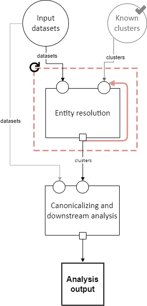

.. _pipeline_schema_workarounds:

Pipeline Schema Workarounds
===========================

.. contents::
   :depth: 2
   :local:

The pipeline schema described :ref:`on the main Pipeline Schema page <easylink_pipeline_schema>`
is conceptually correct, but the EasyLink software currently can't implement it exactly as documented.
For this reason, we've modified the pipeline schema actually implemented in subtle ways.
The good news is that **these have almost no impact on users running pipelines.**
So, if your interactions with EasyLink are all through ``easylink run``, you do not need to understand
the content on this page.
The workarounds described here are, however, important for *creating* implementations to use in
EasyLink.

Input data provided as a list, not a directory
----------------------------------------------

In the :ref:`slots section <slots>`, it says "we currently think of data in terms of *files or directories*."
However, there are currently some exceptions to the "files or directories"
description.
The first is that input data that come directly from the user (through an ``input_data.yaml``)
are represented and passed to implementations as *lists* of file paths.
All of the "datasets" arrows in the schema that come from the original
"Input datasets" node, including within the sub-steps of entity resolution,
follow the "datasets" schema :ref:`as documented <datasets>` except that
instead of containing a *directory* of datasets, they contain a *list* of datasets.

See also the next section, which is closely related to this one.

Input data provided together, rather than separated by type
-----------------------------------------------------------

The pipeline schema diagram shows two nodes for user input: input datasets and known clusters.

However, EasyLink currently only supports one type (or "slot") of user input.
As a workaround, we essentially merge these two nodes in the diagram.
Because, as described in the previous section, multiple user inputs are provided as a list,
it is a list of all the input datasets *and* the known clusters file.

Slots that receive a data dependency from either of these types of user input actually
receive the entire list, including the files not meant for that slot.
The implementation internally must select the relevant file(s) to use.
The rule about how to do this is that the file with a name containing ``clusters`` is the known clusters,
and all other files in the list are input datasets.

Cloneable sections do not have splitters
----------------------------------------

In the diagrams, cloneable sections are shown with splitters, for example in
this diagram of :ref:`the sub-steps of entity resolution <entity_resolution_sub_steps>`:

.. image:: pipeline_schema/images/entity_resolution_sub_steps.drawio.png

Here, the "by file" splitter (the triangle at the top of the dashed blue cloneable section)
splits a set of datasets into its constituent parts.

EasyLink contains some functionality to achieve this, but it has some limitations [#]_ and
is not currently used.
Instead, the *implementation* is expected to do the splitting, by selecting the relevant
file out of what it is given, which is all the files.

It knows which file is the relevant one according to an environment variable
**set by the user** in their ``pipeline.yaml``.
This is a user-facing change.
The ``pipeline.yaml`` section for the cloneable section diagrammed above might look like:

.. code-block:: yaml
   :emphasize-lines: 7,12,17,22

   determining_exclusions_and_removing_records:
     clones:
       - determining_exclusions:
           implementation:
             name: default_determining_exclusions
             configuration:
               INPUT_DATASET: input_file_1
         removing_records:
           implementation:
             name: default_removing_records
             configuration:
               INPUT_DATASET: input_file_1
       - determining_exclusions:
           implementation:
             name: default_determining_exclusions
             configuration:
               INPUT_DATASET: input_file_2
         removing_records:
           implementation:
             name: default_removing_records
             configuration:
               INPUT_DATASET: input_file_2

The highlighted lines are where the environment variable is passed which tells the implementation
how to select the relevant file.
Note that the splitter must be emulated in implementations of both steps, because
both steps in the above diagram received the output of the splitter.

It is very important that the user:

* Create a number of clones (items in the list under ``clones``) that matches the number of files
* Pass each clone the name of one of the files
* Pass each sub-step *within* each clone the same file name

Due to the workaround, none of this is enforced by EasyLink.

.. [#] It can only split edges that come from user input, and must split all such edges if it splits any.

Cloneable section aggregators create lists
------------------------------------------

Eventually, the aggregators (funnel icons) on data dependencies passing *out* of a cloneable section
will create directories.
However, they currently create lists of file paths, similar to the first limitation listed on this page about user input data
(this is the other place where data dependencies are not files or directories).
An implementation whose input comes from a cloneable section's aggregator will receive a list.

This means that in the following diagram, where eventually the "by file" aggregator will
aggregate a set of directories into a single flat directory, it currently will create
a list of *directory* paths (each containing one dataset).

.. image:: pipeline_schema/images/entity_resolution_sub_steps.drawio.png