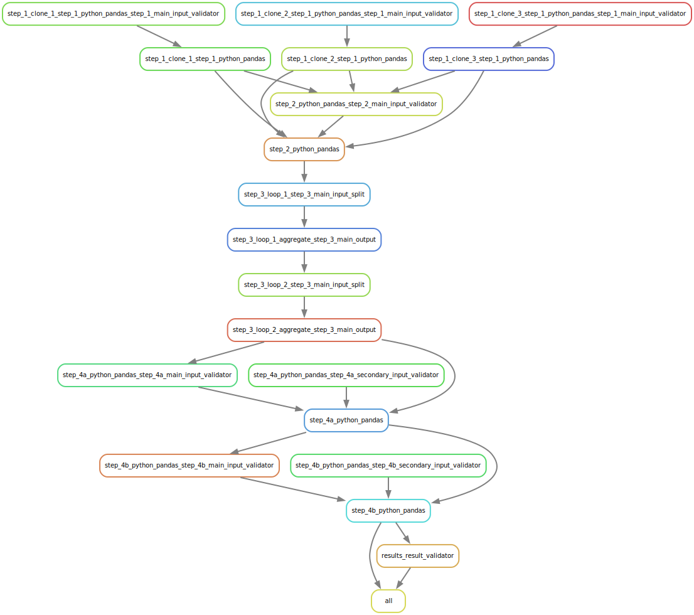

.. _getting_started:

===============
Getting Started
===============

First Pipeline
==============

``common/pipeline.yaml``
------------------------
Let's run our first pipeline with EasyLink by passing pipeline specification, input data specification, and 
environment specification files to the :ref:`easylink run <cli>` command.

This command will validate the pipeline specification against the pipeline schema and configure and run the pipeline.
We will start by using some pre-written specifications from the the EasyLink automated tests, and will explain 
more about the contents of the specifications later.

.. note::
   The steps run by this pipeline are dummy steps designed for EasyLink development. This tutorial 
   will need to be updated to reflect the record linkage pipeline schema when it is available, rather than the dummy
   development schema.

.. note::
   At the moment the EasyLink tests require input files stored on the IHME cluster, so it is not yet 
   possible to run them without IHME cluster access.

.. todo::
   Change below to use local environment

.. code-block:: console

   $ conda activate easylink
   $ cd tests
   $ easylink run -p specifications/common/pipeline.yaml -i specifications/common/input_data.yaml -e specifications/e2e/environment_slurm.yaml
   2025-04-01 06:51:22.146 | 0:00:09.139203 | run:158 - Running pipeline
   2025-04-01 06:51:22.147 | 0:00:09.139873 | run:160 - Results directory: /mnt/share/homes/tylerdy/easylink/tests/results/2025_04_01_06_51_22
   2025-04-01 06:51:26.220 | 0:00:13.212825 | main:115 - Running Snakemake
   [Tue Apr  1 06:51:26 2025]
   Job 9: Validating step_4_python_pandas input slot step_4_secondary_input
   Reason: Missing output files: input_validations/step_4_python_pandas/step_4_secondary_input_validator
   [Tue Apr  1 06:51:26 2025]
   Job 6: Validating step_1_python_pandas input slot step_1_main_input
   Reason: Missing output files: input_validations/step_1_python_pandas/step_1_main_input_validator
   [Tue Apr  1 06:51:27 2025]
   Job 5: Running step_1 implementation: step_1_python_pandas
   Reason: Missing output files: intermediate/step_1_python_pandas/result.parquet; Input files updated by another job: input_validations/step_1_python_pandas/step_1_main_input_validator
   [Tue Apr  1 07:23:28 2025]
   Job 7: Validating step_2_python_pandas input slot step_2_main_input
   Reason: Missing output files: input_validations/step_2_python_pandas/step_2_main_input_validator; Input files updated by another job: intermediate/step_1_python_pandas/result.parquet
   ...
   [Tue Apr  1 07:26:18 2025]
   Job 0: Grabbing final output
   Reason: Missing output files: result.parquet; Input files updated by another job: intermediate/step_4_python_pandas/result.parquet, input_validations/final_validator

When the pipeline runs, we see validation happen first for steps 1 and 4, then the steps running in order from 1 to 4.
The last job gets the final output from step 4.

Inputs and outputs
------------------
Input and output data is stored in parquet files. The locations of the input data files passed to EasyLink 
in our last command are found in ``specifications/common/input_data.yaml``.
We can view the contents of these Parquet files using Python:

.. code-block:: console

   $ # Create/activate a conda environment if you don't want to install globally!
   $ pip install pandas pyarrow
   $ python
   >>> import pandas as pd
   >>> pd.read_parquet("/mnt/team/simulation_science/priv/engineering/er_ecosystem/sample_data/dummy/input_file_1.parquet")
          foo bar  counter
   0        0   a        0
   1        1   b        0
   2        2   c        0
   3        3   d        0
   4        4   e        0
   ...    ...  ..      ...
   9995  9995   a        0
   9996  9996   b        0
   9997  9997   c        0
   9998  9998   d        0
   9999  9999   e        0

   [10000 rows x 3 columns]

The other two input files look identical, each with 10k rows.

It can also be useful to setup an alias to more easily preview parquet files. Add the following to your 
``.bash_aliases`` or ``.bashrc`` file, and restart your terminal.

.. code-block:: console

   pqprint() { python -c "import pandas as pd; print(pd.read_parquet('$1'))" ; }

Let's use the alias to print the results parquet, the location of which was printed when we ran the pipeline.

.. code-block:: console

   $ pqprint results/2025_04_01_06_51_22/result.parquet
           foo bar  counter  added_column_0  added_column_1  added_column_2  added_column_3  added_column_4
   0         0   a        4             0.0             1.0             2.0             3.0               4
   1         1   b        4             0.0             1.0             2.0             3.0               4
   2         2   c        4             0.0             1.0             2.0             3.0               4
   3         3   d        4             0.0             1.0             2.0             3.0               4
   4         4   e        4             0.0             1.0             2.0             3.0               4
   ...     ...  ..      ...             ...             ...             ...             ...             ...
   59995  9995   a        1             0.0             0.0             0.0             0.0               4
   59996  9996   b        1             0.0             0.0             0.0             0.0               4
   59997  9997   c        1             0.0             0.0             0.0             0.0               4
   59998  9998   d        1             0.0             0.0             0.0             0.0               4
   59999  9999   e        1             0.0             0.0             0.0             0.0               4

If we compare the input data to the results, we can see that new columns were added, the data now has 60k rows, 
the counter column is incremented for many rows, and other columns have different values for different rows 
as well.
Next we will examine the steps the pipeline executed, where they are defined and implemented, and how they transformed 
the data.

Pipeline schema and steps
-------------------------
.. note::
   This section will likely be very different for the record linkage pipeline schema which will have 
   different steps. It will need to be updated when we are no longer using the dummy development schema, but 
   for now these are my notes for understanding what happens when we run a schema.

The pipeline specification we passed to ``easylink run``, ``specifications/common/pipeline.yaml``, 
configures the pipeline for this run, by specifying configuration details for each step 
defined by the pipeline schema. The schema steps, and the edges between them, are defined in 
``pipeline_schema_constants/development.py``. The schema steps, or nodes, define input and output slots for 
data used or produced by the schema steps, as well as any logical or behavioral structure of the step,
such as defining a step as a ``LoopStep``, ``ParallelStep``, ``ChoiceStep``, or ``HierarchicalStep``. The edges 
define how data moves between steps' input and output slots.

``pipeline_schema_constants/development.py`` defines that the pipeline schema requires four steps, that the 
third step is ``EmbarrassinglyParallel``, that the fourth step is a ``ChoiceStep``, and that all steps have 
one input except the fourth step, which has two.

.. todo::
   Include a diagram for the record linkage schema when available.

An implementation is chosen for each step, which defines a 
container, script, outputs and other details for a step. The possible implementations for each of the steps in 
``pipeline_schema_constants/development.py`` are defined in ``implementation_metadata.yaml``. For each 
development schema step, one of these implementations is chosen and specified in the pipeline specification 
``specifications/common/pipeline.yaml``.

With this understanding of the schema/implementation/configuration architecture, we can check the inputs 
to each step in our specified implementation. ``step_4_python_pandas`` in ``implementation_metadata.yaml`` 
passes the value ``"DUMMY_CONTAINER_MAIN_INPUT_FILE_PATHS,DUMMY_CONTAINER_SECONDARY_INPUT_FILE_PATHS"`` 
to the ``env`` parameter ``INPUT_ENV_VARS``, specifying its two inputs. Note that the default value for 
``INPUT_ENV_VARS`` in the dummy implementation is ``DUMMY_CONTAINER_MAIN_INPUT_FILE_PATHS``, which will be 
used for ``step_1_python_pandas``, ``step_2_python_pandas`` and ``step_3_python_pandas`` which do not set a 
value for ``INPUT_ENV_VARS`` as they only have one input (the default).

.. note::
   ``INPUT_ENV_VARS`` will probably not have an analogue in the record linkage pipeline schema.

Running the pipeline generates a DAG.svg file in the results directory which shows the implementations 
and data dependencies in the pipeline.

.. image:: DAG-common-pipeline.svg
   :width: 400

As you can see, each implementation has a single input and a validator for it, 
except that ``step_4`` has two inputs, as defined in 
``pipeline_schema_constants/development.py`` and discussed above. 

.. warning::
   Note that this diagram doesn't show the dependencies on original (user-provided) input data, and 
   displays validations, and doesn't show Step 3 because it is embarrassingly parallel. See 
   `this ticket <https://jira.ihme.washington.edu/browse/MIC-5767>`_ where we plan to fix these issues.

Now we can understand why the final output has 60k rows. For the current dummy implementation, when there are multiple input data files, the rows 
in the files are concatenated. So ``step_1`` concatenates three 10k row datasets, and ``step_4`` concatenates these 
30k rows with another 30k rows.

``step_3`` is aggregated and split because it is defined as 
``EmbarrassinglyParallel``.

We've already viewed the final output, but if we want to see how the data is transformed over the course 
of the pipeline, we can view intermediary outputs as well::

   $ pqprint results/2025_04_01_06_51_22/intermediate/step_1_python_pandas/result.parquet
            foo bar  counter  added_column_0  added_column_1
   0         0   a        1               0               1
   1         1   b        1               0               1
   2         2   c        1               0               1
   3         3   d        1               0               1
   4         4   e        1               0               1
   ...     ...  ..      ...             ...             ...
   29995  9995   a        1               0               1
   29996  9996   b        1               0               1
   29997  9997   c        1               0               1
   29998  9998   d        1               0               1
   29999  9999   e        1               0               1

   [30000 rows x 5 columns]

More Pipeline Specifications
============================
The ``tests`` folder includes several other pipeline specification files (YAML files). While some are special 
configurations only usable by the testing infrastructure, others can be run directly using the command line - the 
ones with four steps which target the development schema. Let's try running another complete pipeline.

``e2e/pipeline.yaml``
---------------------
This pipeline is different from ``common/pipeline.yaml`` in that steps 2 and 4 have different implementations 
(for example, step 2 runs on Spark here), and that steps 2-4 are configured to increment the counter in the input data by a custom value, as can be seen by
comparing the YAMLs.

.. code-block:: console

   $ easylink run -p specifications/e2e/pipeline.yaml -i specifications/common/input_data.yaml -e specifications/e2e/environment_slurm.yaml
   2025-04-02 09:37:40.320 | 0:00:01.436867 | run:158 - Running pipeline
   2025-04-02 09:37:40.321 | 0:00:01.437074 | run:160 - Results directory: /mnt/share/homes/tylerdy/easylink/tests/results/2025_04_02_09_37_40
   ...
   [Wed Apr  2 09:42:05 2025]
   Job 0: Grabbing final output
   Reason: Missing output files: result.parquet; Input files updated by another job: intermediate/step_4_r/result.parquet, input_validations/final_validator, spark_logs/spark_master_log.txt, spark_logs/spark_worker_log_1-of-1.txt, spark_logs/spark_master_terminated.txt

.. code-block:: console

   $ pqprint results/2025_04_02_09_37_40/result.parquet
         foo bar  counter  ...  added_column_1713  added_column_1714  added_column_1715
   0         0   a     1715  ...               1713               1714               1715
   1         1   b     1715  ...               1713               1714               1715
   2         2   c     1715  ...               1713               1714               1715
   3         3   d     1715  ...               1713               1714               1715
   4         4   e     1715  ...               1713               1714               1715
   ...     ...  ..      ...  ...                ...                ...                ...
   59995  9995   a      912  ...               1713               1714               1715
   59996  9996   b      912  ...               1713               1714               1715
   59997  9997   c      912  ...               1713               1714               1715
   59998  9998   d      912  ...               1713               1714               1715
   59999  9999   e      912  ...               1713               1714               1715

   [60000 rows x 8 columns]

.. todo::
   Explain spark in above diagram

``e2e/pipeline_expanded.yaml``
------------------------------
A longer, more complex pipeline.

.. code-block:: console

   $ easylink run -p specifications/e2e/pipeline_expanded.yaml -i specifications/common/input_data.yaml -e specifications/e2e/environment_slurm.yaml
   2025-04-01 07:04:16.812 | 0:00:01.500753 | run:158 - Running pipeline
   2025-04-01 07:04:16.812 | 0:00:01.500984 | run:160 - Results directory: /mnt/share/homes/tylerdy/easylink/tests/results/2025_04_01_07_04_16
   ...
   [Tue Apr  1 07:27:22 2025]
   Job 0: Grabbing final output
   Reason: Missing output files: result.parquet; Input files updated by another job: intermediate/step_4b_python_pandas/result.parquet, input_validations/final_validator

.. code-block:: console

   $ pqprint results/2025_04_01_07_04_16/result.parquet
            foo bar  counter  added_column_2  added_column_3  added_column_4  added_column_5  added_column_6
   0          0   a        6             2.0             3.0             4.0             5.0               6
   1          1   b        6             2.0             3.0             4.0             5.0               6
   2          2   c        6             2.0             3.0             4.0             5.0               6
   3          3   d        6             2.0             3.0             4.0             5.0               6
   4          4   e        6             2.0             3.0             4.0             5.0               6
   ...      ...  ..      ...             ...             ...             ...             ...             ...
   149995  9995   a        1             0.0             0.0             0.0             0.0               6
   149996  9996   b        1             0.0             0.0             0.0             0.0               6
   149997  9997   c        1             0.0             0.0             0.0             0.0               6
   149998  9998   d        1             0.0             0.0             0.0             0.0               6
   149999  9999   e        1             0.0             0.0             0.0             0.0               6

   [150000 rows x 8 columns]

That's all the valid pipelines currently available in the ``tests`` directory! Next we will create
some pipelines of our own to run by copying the ``tests`` pipelines and making some changes.