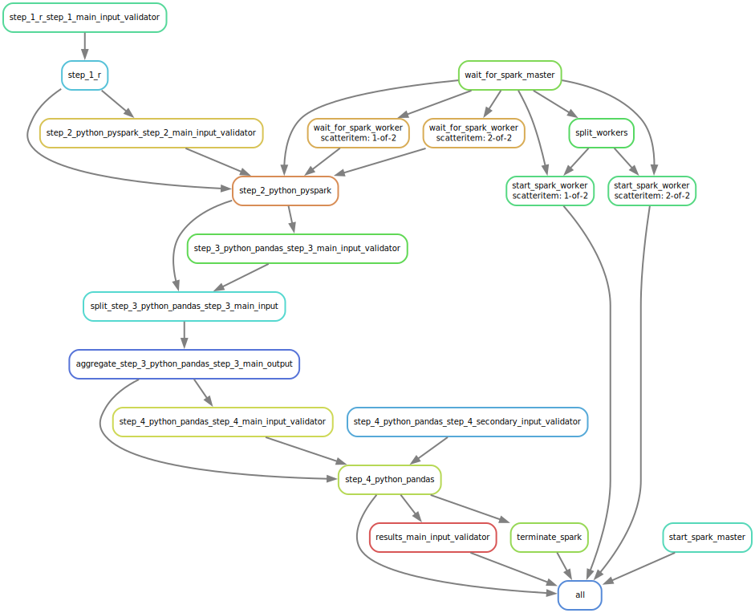

.. _getting_started:

===============
Getting Started
===============

First Pipeline
==============

``common/pipeline.yaml``
------------------------
Let's run our first pipeline with EasyLink by passing pipeline specification, input data specification, and 
environment specification files to the :ref:`easylink run <cli>` command.

This command will validate the pipeline specification against the pipeline schema and configure and run the pipeline.
We will start by using some pre-written specifications from the the EasyLink automated tests, and will explain 
more about the contents of the specifications later.

.. note::
   The steps run by this pipeline are dummy steps designed for EasyLink development. This tutorial 
   will need to be updated to reflect the record linkage pipeline schema when it is available, rather than the dummy
   development schema.

.. note::
   At the moment the EasyLink tests require input files stored on the IHME cluster, so it is not yet 
   possible to run them without IHME cluster access.

.. code-block:: console

   $ conda activate easylink
   $ cd tests
   $ easylink run -p specifications/common/pipeline.yaml -i specifications/common/input_data.yaml -e specifications/common/environment_local.yaml
   2025-04-22 10:41:27.992 | 0:00:02.533972 | run:158 - Running pipeline
   2025-04-22 10:41:27.993 | 0:00:02.535549 | run:160 - Results directory: /mnt/share/homes/tylerdy/easylink/tests/results/2025_04_22_10_41_27
   2025-04-22 10:41:31.621 | 0:00:06.163666 | main:115 - Running Snakemake
   [Tue Apr 22 10:41:32 2025]
   Job 9: Validating step_4_python_pandas input slot step_4_secondary_input
   Reason: Missing output files: input_validations/step_4_python_pandas/step_4_secondary_input_validator
   [Tue Apr 22 10:41:32 2025]
   Job 6: Validating step_1_python_pandas input slot step_1_main_input
   Reason: Missing output files: input_validations/step_1_python_pandas/step_1_main_input_validator
   [Tue Apr 22 10:41:34 2025]
   Job 5: Running step_1 implementation: step_1_python_pandas
   Reason: Missing output files: intermediate/step_1_python_pandas/result.parquet; Input files updated by another job: input_validations/step_1_python_pandas/step_1_main_input_validator
   [Tue Apr 22 10:41:37 2025]
   Job 7: Validating step_2_python_pandas input slot step_2_main_input
   Reason: Missing output files: input_validations/step_2_python_pandas/step_2_main_input_validator; Input files updated by another job: intermediate/step_1_python_pandas/result.parquet
   ...
   [Tue Apr 22 10:41:58 2025]
   Job 0: Grabbing final output
   Reason: Missing output files: result.parquet; Input files updated by another job: intermediate/step_4_python_pandas/result.parquet, input_validations/final_validator

.. note:: 
   The pipeline output in its current state can be a little confusing. Note that the number assigned 
   to the slurm jobs is different than the order the jobs are executed in - these job IDs are 
   assigned by snakemake. Also note that the first job to be run is input validation for step 4, along 
   with input validation for step 1 - this is because these are the only jobs with no dependencies 
   in the pipeline DAG, which is shown in the `Pipeline schema and steps`_ section.

   Finally, despite the final output line containing the phrase "Missing output files", 
   this pipeline finished executing successfully. The "Reason" displayed in the output is explaining 
   why the job was run (the step inputs were ready but the output file did not yet exist), not 
   conveying an error message.

   We have a `ticket <https://jira.ihme.washington.edu/browse/MIC-6019>`_ about improving this.

Inputs and outputs
------------------
Input and output data is stored in parquet files. The locations of the input data files passed to EasyLink 
in our last command are found in ``specifications/common/input_data.yaml``.
We can view the contents of these Parquet files using Python:

.. code-block:: console

   $ # Create/activate a conda environment if you don't want to install globally!
   $ pip install pandas pyarrow
   $ python
   >>> import pandas as pd
   >>> pd.read_parquet("/mnt/team/simulation_science/priv/engineering/er_ecosystem/input_data/dummy/input_file_1.parquet")
          foo bar  counter
   0        0   a        0
   1        1   b        0
   2        2   c        0
   3        3   d        0
   4        4   e        0
   ...    ...  ..      ...
   9995  9995   a        0
   9996  9996   b        0
   9997  9997   c        0
   9998  9998   d        0
   9999  9999   e        0

   [10000 rows x 3 columns]

The other two input files look identical, each with 10k rows.

It can also be useful to setup an alias to more easily preview parquet files. Add the following to your 
``.bash_aliases`` or ``.bashrc`` file, and restart your terminal.

.. code-block:: console

   pqprint() { python -c "import pandas as pd; print(pd.read_parquet('$1'))" ; }

Let's use the alias to print the results parquet, the location of which was printed when we ran the pipeline.

.. code-block:: console

   $ pqprint results/2025_04_22_10_41_27/result.parquet
           foo bar  counter  added_column_0  added_column_1  added_column_2  added_column_3  added_column_4
   0         0   a        4             0.0             1.0             2.0             3.0               4
   1         1   b        4             0.0             1.0             2.0             3.0               4
   2         2   c        4             0.0             1.0             2.0             3.0               4
   3         3   d        4             0.0             1.0             2.0             3.0               4
   4         4   e        4             0.0             1.0             2.0             3.0               4
   ...     ...  ..      ...             ...             ...             ...             ...             ...
   59995  9995   a        1             0.0             0.0             0.0             0.0               4
   59996  9996   b        1             0.0             0.0             0.0             0.0               4
   59997  9997   c        1             0.0             0.0             0.0             0.0               4
   59998  9998   d        1             0.0             0.0             0.0             0.0               4
   59999  9999   e        1             0.0             0.0             0.0             0.0               4

If we compare the input data to the results, we can see that new columns were added, the data now has 60k rows, 
the counter column is incremented for many rows, and other columns have different values for different rows 
as well.
Next we will examine the steps the pipeline executed, where they are defined and implemented, and how they transformed 
the data.

.. _Pipeline schema and steps:

Pipeline schema and steps
-------------------------
.. note::
   This section will likely be very different for the record linkage pipeline schema which will have 
   different steps. It will need to be updated when we are no longer using the dummy development schema, but 
   for now these are my notes for understanding what happens when we run a schema.

The pipeline specification we passed to ``easylink run``, ``specifications/common/pipeline.yaml``, 
configures the pipeline for this run, by specifying configuration details for each step 
defined by the pipeline schema. The schema steps, and the edges between them, are defined in 
``pipeline_schema_constants/development.py``. The schema steps, or nodes, define input and output slots for 
data used or produced by the schema steps, as well as any logical or behavioral structure of the step,
such as defining a step as a ``LoopStep``, ``CloneableStep``, ``ChoiceStep``, or ``HierarchicalStep``. The edges 
define how data moves between steps' input and output slots.

``pipeline_schema_constants/development.py`` defines that the pipeline schema requires four steps, that the 
third step is ``AutoParallel``, that the fourth step is a ``ChoiceStep``, and that all steps have 
one input except the fourth step, which has two.
The edges in the ``EDGES`` variable in that file connect the steps, so an output from one becomes an input
to another.

.. todo::
   Include a diagram for the record linkage schema when available.

An implementation is chosen for each step, which defines a 
`Singularity container <https://docs.sylabs.io/guides/latest/user-guide/>`_, script,
outputs and other details for a step. The possible implementations for each of the steps in 
``pipeline_schema_constants/development.py`` are defined in ``implementation_metadata.yaml``. For each 
development schema step, one of these implementations is chosen and specified in the pipeline specification 
``specifications/common/pipeline.yaml``.

You can see in the ``implementation_metadata.yaml`` that the ``_python_pandas`` implementations we've selected
for the four steps all use the same Singularity container, or ``image_path``.
However, the step implementations can't be the exact same, because Step 4 has two inputs.
The default behavior of the container is to accept a *single* input using the environment variable
``DUMMY_CONTAINER_MAIN_INPUT_FILE_PATHS``, which is the environment variable specified in the single
input slot defined in ``pipeline_schema_constants/development.py`` for Steps 1, 2, and 3.
If this default behavior weren't changed for Step 4, ``step_4_python_pandas`` would ignore the second
input it receives!
To correct this, ``step_4_python_pandas`` in ``implementation_metadata.yaml``
passes the value ``"DUMMY_CONTAINER_MAIN_INPUT_FILE_PATHS,DUMMY_CONTAINER_SECONDARY_INPUT_FILE_PATHS"`` 
to the ``env`` parameter ``INPUT_ENV_VARS``.
This changes the behavior of the container to read from both environment variables specified
on Step 4's input slots, rather than only ``DUMMY_CONTAINER_MAIN_INPUT_FILE_PATHS``, which is the default value for ``INPUT_ENV_VARS``.

.. note::
   EasyLink wouldn't throw an error if the container's default behavior were used for ``step_4_python_pandas``;
   EasyLink makes inputs *available* to each implementation according
   to the definition of the implemented step in the pipeline schema, but it has no way of knowing whether
   a given implementation is actually *using* those inputs.

.. note::
   This use of ``env`` in the ``implementation_metadata.yaml`` is a result of using a single container
   for multiple implementations.
   In the record linkage pipeline schema, we anticipate there being a separate container for each implementation,
   so ``INPUT_ENV_VARS`` will probably not have an analogue.

Running the pipeline generates a DAG.svg file in the results directory which shows the implementations 
and data dependencies in the pipeline.

.. image:: DAG-common-pipeline.svg
   :width: 400

As you can see, each implementation has a single input and a validator for it, 
except that ``step_4`` has two inputs, as defined in 
``pipeline_schema_constants/development.py`` and discussed above. 

.. warning::
   Note that this diagram doesn't show the dependencies on original (user-provided) input data, and 
   displays validations, and doesn't show Step 3 because it is an auto-parallel step. See 
   `this ticket <https://jira.ihme.washington.edu/browse/MIC-5767>`_ where we plan to fix these issues.

Now we can understand why the final output has 60k rows. For the current dummy implementation, when there are multiple input data files, the rows 
in the files are concatenated. So ``step_1`` concatenates three 10k row datasets, and ``step_4`` concatenates these 
30k rows with another 30k rows.

``step_3`` is aggregated and split because it is defined as ``AutoParallel``.

We've already viewed the final output, but if we want to see how the data is transformed over the course 
of the pipeline, we can view intermediary outputs as well::

   $ pqprint results/2025_04_22_10_41_27/intermediate/step_1_python_pandas/result.parquet
            foo bar  counter  added_column_0  added_column_1
   0         0   a        1               0               1
   1         1   b        1               0               1
   2         2   c        1               0               1
   3         3   d        1               0               1
   4         4   e        1               0               1
   ...     ...  ..      ...             ...             ...
   29995  9995   a        1               0               1
   29996  9996   b        1               0               1
   29997  9997   c        1               0               1
   29998  9998   d        1               0               1
   29999  9999   e        1               0               1

   [30000 rows x 5 columns]

Environments
============
The ``--computing-environment`` (``-e``) argument to ``easylink run`` accepts a YAML file specifying 
information about the computing environment which will execute the steps of the 
pipeline. When we ran our first pipeline, ``tests/specifications/common/pipeline.yaml`` above, we passed 
``tests/specifications/common/environment_local.yaml`` 
to this argument. The contents of this YAML file are shown below.

.. code-block:: yaml

   computing_environment: local
   container_engine: singularity

It specifies a ``local`` computing environment using ``singularity`` as the container engine. These parameters indicate that no new compute resources will 
be used to execute the pipeline steps, and that the Singularity container for each implementation will run within the context where ``easylink run`` is being executed.
For example, if you ran the ``easylink run`` command on your laptop, the implementations would run on your laptop;
if you ran the ``easylink run`` command on a cloud (e.g. EC2) instance that you were connected to with SSH, the implementations would run on that instance,
and so on.

Let's run this same pipeline with the ``slurm`` computing environment. `Slurm <https://slurm.schedmd.com/overview.html>`_ is an open-source job scheduler and 
cluster management system which EasyLink can interface with to schedule and run the steps of a pipeline using the resources of a computing cluster. This means that instead of 
running all pipeline steps in your local computing environment, each step can be run with the additional resources of a separate compute node.

To run the pipeline using slurm, we will pass :download:`environment_slurm.yaml <environment_slurm.yaml>` 
to the ``--computing-environment`` command line parameter. Download the file to the directory you will run ``easylink`` 
in -- I downloaded it to the root ``easylink`` directory. The YAML looks like this:

.. code-block:: yaml

   computing_environment: slurm
   container_engine: singularity
   slurm:
      account: proj_simscience
      partition: all.q
   implementation_resources:
      memory: 1  # GB
      cpus: 1
      time_limit: 1  # hours

The ``account`` and ``partition`` parameters are specific to your Slurm cluster configuration - you may need 
to ask your system administrator for these. The parameters shown above would work for someone on the Simulation 
Science team at IHME. For more information see the `Slurm docs <https://slurm.schedmd.com/overview.html>`_.

The ``implementation_resources`` parameter specifies the compute resources which will be reserved by the Slurm 
system for the implementation container for each step, including a ``time_limit`` for the job's execution.

.. note::
   When using the ``slurm`` environment, you may have to wait for the computing resources your jobs need to become 
   available on the cluster. The wait time will depend on how busy your cluster is with jobs submitted by other users. 

So now that we understand the ``slurm`` configuration, let's run the same ``common/pipeline.yaml`` pipeline from the last 
section, but using the ``slurm`` environment rather than ``local``.

.. code-block:: console

   $ easylink run -p tests/specifications/common/pipeline.yaml -i tests/specifications/common/input_data.yaml -e environment_slurm.yaml
   2025-05-01 08:24:01.901 | 0:00:02.805179 | run:158 - Running pipeline
   2025-05-01 08:24:01.901 | 0:00:02.805621 | run:160 - Results directory: /mnt/share/homes/tylerdy/easylink/results/2025_05_01_08_24_01
   2025-05-01 08:24:05.205 | 0:00:06.109547 | main:115 - Running Snakemake
   [Thu May  1 08:24:06 2025]
   Job 9: Validating step_4_python_pandas input slot step_4_secondary_input
   Reason: Missing output files: input_validations/step_4_python_pandas/step_4_secondary_input_validator
   ...
   [Thu May  1 08:26:16 2025]
   Job 0: Grabbing final output
   Reason: Missing output files: result.parquet; Input files updated by another job: input_validations/final_validator, intermediate/step_4_python_pandas/result.parquet

The output should look identical to the ``local`` output, except that you may notice the timestamps of the jobs are more spread out 
using the ``slurm`` environment. This is because, as noted above, ``slurm`` jobs for each step may need to wait for cluster computing 
resources to become available before they can be scheduled, whereas the computing environment for ``local`` jobs is already active when 
the pipeline is launched (via ``easylink run``), since it *is* the environment the pipeline was launched in.

Since the current step implementations are trivial, this wait time makes the total pipeline execution time longer under the ``slurm`` 
environment. However, for a real large-scale record linkage pipeline, the additional computing resources available on a cluster can make it 
faster than ``local``, or make it *possible* to run the pipeline when it wouldn't be otherwise 
(in the case where the local environment doesn't have sufficient resources to run the pipeline).

Input data
==========
The ``--input-data`` (``-i``) argument to ``easylink run`` accepts a YAML file specifying a list 
of paths to files or directories containing input data to be used by the pipeline. 
When we ran our first pipeline, ``common/pipeline.yaml``, above, we passed 
``tests/specifications/common/input_data.yaml`` 
as this YAML file, shown below::

   input_file_1: /mnt/team/simulation_science/priv/engineering/er_ecosystem/input_data/dummy/input_file_1.parquet
   input_file_2: /mnt/team/simulation_science/priv/engineering/er_ecosystem/input_data/dummy/input_file_2.parquet
   input_file_3: /mnt/team/simulation_science/priv/engineering/er_ecosystem/input_data/dummy/input_file_3.parquet

Let's try passing a different input data specification YAML file, 
:download:`input_data.yaml <input_data.yaml>`, which looks like this::

   input_file_1: input_file_1.parquet
   input_file_2: input_file_2.parquet
   input_file_3: input_file_3.parquet

Download the file to the directory you will run EasyLink in, and then download the three input 
Parquet files, :download:`input_file_1.parquet <input_file_1.parquet>`, :download:`input_file_2.parquet <input_file_2.parquet>` 
and :download:`input_file_3.parquet <input_file_3.parquet>` to the same directory. In this case 
I downloaded them to the root ``easylink`` directory.

These input files look a little different than the three input files we used in the pipelines we ran above, 
where all three input files listed in the YAML specification were identical. Let's compare one of those, 
``/mnt/team/simulation_science/priv/engineering/er_ecosystem/input_data/dummy/input_file_1.parquet``, to 
the three files we will use here::

   $ pqprint /mnt/team/simulation_science/priv/engineering/er_ecosystem/input_data/dummy/input_file_1.parquet
         foo bar  counter
   0        0   a        0
   1        1   b        0
   2        2   c        0
   3        3   d        0
   4        4   e        0
   ...    ...  ..      ...
   9995  9995   a        0
   9996  9996   b        0
   9997  9997   c        0
   9998  9998   d        0
   9999  9999   e        0
   [10000 rows x 3 columns]
   $ pqprint input_file_1.parquet 
      foo bar  counter
   0     0   l       10
   1     1   m       10
   2     2   n       10
   3     3   o       10
   4     4   p       10
   ..  ...  ..      ...
   95   95   l       10
   96   96   m       10
   97   97   n       10
   98   98   o       10
   99   99   p       10

   [100 rows x 3 columns]
   $ pqprint input_file_2.parquet 
      foo bar  counter
   0     0   q       20
   1     1   r       20
   2     2   s       20
   3     3   t       20
   4     4   u       20
   ..  ...  ..      ...
   95   95   q       20
   96   96   r       20
   97   97   s       20
   98   98   t       20
   99   99   u       20
   [100 rows x 3 columns]
   $ pqprint input_file_3.parquet 
      foo bar  counter
   0     0   v       30
   1     1   w       30
   2     2   x       30
   3     3   y       30
   4     4   z       30
   ..  ...  ..      ...
   95   95   v       30
   96   96   w       30
   97   97   x       30
   98   98   y       30
   99   99   z       30
   [100 rows x 3 columns]

Our three new input files look different from each other and from the previous input files.
They have 100 rows each instead of 10000, the ``bar`` column has a different set of values 
for each file, and the ``counter`` in each file starts at a different value.

Let's run the same pipeline as before, but with this new input data YAML.

.. code-block:: console
   
   $ easylink run -p tests/specifications/common/pipeline.yaml -i input_data.yaml -e tests/specifications/common/environment_local.yaml
   2025-05-01 08:05:01.123 | 0:00:02.781384 | run:158 - Running pipeline
   2025-05-01 08:05:01.123 | 0:00:02.781776 | run:160 - Results directory: /mnt/share/homes/tylerdy/easylink/results/2025_05_01_08_05_01
   2025-05-01 08:05:04.498 | 0:00:06.156166 | main:115 - Running Snakemake
   [Thu May  1 08:05:05 2025]
   Job 9: Validating step_4_python_pandas input slot step_4_secondary_input
   Reason: Missing output files: input_validations/step_4_python_pandas/step_4_secondary_input_validator
   ...
   [Thu May  1 08:05:32 2025]
   Job 0: Grabbing final output
   Reason: Missing output files: result.parquet; Input files updated by another job: intermediate/step_4_python_pandas/result.parquet, input_validations/final_validator
   $ pqprint results/2025_05_01_08_05_01/result.parquet 
      foo bar  counter  added_column_0  added_column_1  added_column_2  added_column_3  added_column_4
   0      0   l       14             0.0             1.0             2.0             3.0               4
   1      1   m       14             0.0             1.0             2.0             3.0               4
   2      2   n       14             0.0             1.0             2.0             3.0               4
   3      3   o       14             0.0             1.0             2.0             3.0               4
   4      4   p       14             0.0             1.0             2.0             3.0               4
   ..   ...  ..      ...             ...             ...             ...             ...             ...
   595   95   v       31             0.0             0.0             0.0             0.0               4
   596   96   w       31             0.0             0.0             0.0             0.0               4
   597   97   x       31             0.0             0.0             0.0             0.0               4
   598   98   y       31             0.0             0.0             0.0             0.0               4
   599   99   z       31             0.0             0.0             0.0             0.0               4

As expected, the ``results.parquet`` has 600 rows (as opposed to 60k with the old input YAML) 
and the range of ``bar`` and ``counter``  values are consistent 
with our new input files. As before, the transformation of the data is specific to the development schema and will 
change.

Implementations
===============
EasyLink is a powerful tool that allows users to use any valid implementation for each step in the pipeline. 
Users can define their own implementations or use Easylink-provided ones. In the pipelines we've run so far, 
we've only used the ``python_pandas`` implementations of the development schema steps, as we can see if we 
look at ``tests/specifications/common/pipeline.yaml``::

   steps:
      step_1:
         implementation:
            name: step_1_python_pandas
      step_2:
         implementation:
            name: step_2_python_pandas
      step_3:
         implementation:
            name: step_3_python_pandas
      choice_section:
         type: simple
         step_4:
            implementation:
               name: step_4_python_pandas

Let's try an example where we choose some alternative implementations instead. For now, while we are using 
the development pipeline schema, the implementations we can choose from are listed in 
``implementation_metadata.yaml``. In addition to the ``step_N_python_pandas`` implementations, each step 
also has a ``step_N_r`` implementation and a ``step_N_python_pyspark`` implementation to choose from.

For the purposes of the development pipeline, all these implementations will have the same effect on the 
data, but the ``r`` implementation is written in R instead of Python, and the ``python_pyspark`` implementation is written 
using the `Python API for Apache Spark <https://spark.apache.org/docs/latest/api/python/index.html>`_ and 
utilizes `Spark <https://spark.apache.org/>`_ for distributed data processing. Running a Spark 
implementation involves some additional setup and initialization of the Spark engine during the step, but 
enables distributed processing of a large-scale dataset on high-performance computing nodes or clusters. 

Let's run a new pipeline defined in :download:`r_spark_pipeline.yaml <r_spark_pipeline.yaml>` which uses 
all three of our currently available types of implementations::

   steps:
      step_1:
         implementation:
            name: step_1_r
      step_2:
         implementation:
            name: step_2_python_pyspark
      step_3:
         implementation:
            name: step_3_python_pandas
      choice_section:
         type: simple
         step_4:
            implementation:
               name: step_4_python_pandas

Download the file to the directory you will run EasyLink in, and then run the pipeline::

   $ easylink run -p r_spark_pipeline.yaml -i tests/specifications/common/input_data.yaml -e tests/specifications/common/environment_local.yaml
   2025-05-06 12:04:36.283 | 0:00:01.876659 | run:158 - Running pipeline
   2025-05-06 12:04:36.283 | 0:00:01.876886 | run:160 - Results directory: /mnt/share/homes/tylerdy/easylink/results/2025_05_06_12_04_36
   2025-05-06 12:04:39.437 | 0:00:05.031270 | main:115 - Running Snakemake
   [Tue May  6 12:04:40 2025]
   localrule wait_for_spark_master:
      output: spark_logs/spark_master_uri.txt
      jobid: 9
      reason: Missing output files: spark_logs/spark_master_uri.txt
      resources: tmpdir=/tmp
   [Tue May  6 12:04:40 2025]
   Job 12: Validating step_4_python_pandas input slot step_4_secondary_input
   Reason: Missing output files: input_validations/step_4_python_pandas/step_4_secondary_input_validator
   [Tue May  6 12:04:40 2025]
   localrule start_spark_master:
      output: spark_logs/spark_master_log.txt
      jobid: 16
      reason: Missing output files: spark_logs/spark_master_log.txt
      resources: tmpdir=/tmp
   ...
   [Tue May  6 12:04:42 2025]
   Job 5: Running step_1 implementation: step_1_r
   Reason: Missing output files: intermediate/step_1_r/result.parquet; Input files updated by another job: input_validations/step_1_r/step_1_main_input_validator
   ...
   [Tue May  6 12:05:10 2025]
   Job 4: Running step_2 implementation: step_2_python_pyspark
   Reason: Missing output files: intermediate/step_2_python_pyspark/result.parquet; Input files updated by another job: spark_logs/spark_worker_started_2-of-2.txt, input_validations/step_2_python_pyspark/step_2_main_input_validator, intermediate/step_1_r/result.parquet, spark_logs/spark_worker_started_1-of-2.txt, spark_logs/spark_master_uri.txt
   ...
   [Tue May  6 12:05:58 2025]
   Job 0: Grabbing final output
   Reason: Missing output files: result.parquet; Input files updated by another job: spark_logs/spark_worker_log_2-of-2.txt, spark_logs/spark_master_terminated.txt, intermediate/step_4_python_pandas/result.parquet, spark_logs/spark_worker_log_1-of-2.txt, input_validations/final_validator, spark_logs/spark_master_log.txt

We can see in the output that both the ``pyspark`` and ``r`` implementations were run. The output also shows 
some of the PySpark setup -- the full output shows more of the process, such as the initialization of the Spark 
master and workers (see the `Spark documentation <https://spark.apache.org/docs/latest/>`_ for more information) 
and the splitting and aggregating of input data chunks for Spark processing. 

We can also vizualize the new implementations in the pipeline DAG:

If we check we'll see that the results are the same as they were when we ran
``tests/specifications/common/pipeline.yaml`` previously::

   $ pqprint results/2025_05_06_12_04_36/result.parquet 
           foo bar  counter  added_column_0  added_column_1  added_column_2  added_column_3  added_column_4
   0         0   a        4             0.0             1.0             2.0             3.0               4
   1         1   b        4             0.0             1.0             2.0             3.0               4
   2         2   c        4             0.0             1.0             2.0             3.0               4
   3         3   d        4             0.0             1.0             2.0             3.0               4
   4         4   e        4             0.0             1.0             2.0             3.0               4
   ...     ...  ..      ...             ...             ...             ...             ...             ...
   59995  9995   a        1             0.0             0.0             0.0             0.0               4
   59996  9996   b        1             0.0             0.0             0.0             0.0               4
   59997  9997   c        1             0.0             0.0             0.0             0.0               4
   59998  9998   d        1             0.0             0.0             0.0             0.0               4
   59999  9999   e        1             0.0             0.0             0.0             0.0               4
   [60000 rows x 8 columns]

Implementation Configuration
----------------------------
Additionally, implementations can be configured in the pipeline YAML. An implementation may have some settings
that allow it to be configured in different ways for different pipelines. These settings are defined by the 
implementation itself, rather than the pipeline schema, so it is up to the user of the implementation to 
understand and configure them. 

These settings are configured by placing environment variables in the ``configuration`` section of the 
``implementation`` definition in the YAML. We'll use a new pipeline YAML, 
:download:`impl-config-pipeline.yaml <impl-config-pipeline.yaml>`, as an example::

   steps:
      step_1:
         implementation:
            name: step_1_python_pandas
            configuration:
               DUMMY_CONTAINER_INCREMENT: 11
      step_2:
         implementation:
            name: step_2_python_pandas
            configuration:
               DUMMY_CONTAINER_INCREMENT: 50
      step_3:
         implementation:
            name: step_3_python_pandas
      choice_section:
         type: simple
         step_4:
            implementation:
               name: step_4_python_pandas

The ``python_pandas`` implementations define an environment variable ``DUMMY_CONTAINER_INCREMENT`` which 
specifies the number of columns the step should add to the dataset (the default is 1). As in other 
parts of this tutorial, this particular implementation, and therefore the associated environment variable,
is specific to the development schema, but the 
concept of configuring implementations using environment variables is not. Real record linkage implementations 
will have environment variables which will be configurable in the same way.

Let's run our pipeline and see how the results compare to the ``tests/specifications/common/pipeline.yaml`` 
results that have been our baseline throughout the tutorial. 

.. code-block:: console

   $ easylink run -p impl-config-pipeline.yaml -i tests/specifications/common/input_data.yaml -e tests/specifications/common/environment_local.yaml 
   2025-05-06 08:44:38.236 | 0:00:04.044818 | run:158 - Running pipeline
   2025-05-06 08:44:38.236 | 0:00:04.045102 | run:160 - Results directory: /mnt/share/homes/tylerdy/easylink/results/2025_05_06_08_44_38
   2025-05-06 08:44:40.749 | 0:00:06.557575 | main:115 - Running Snakemake
   [Tue May  6 08:44:41 2025]
   Job 9: Validating step_4_python_pandas input slot step_4_secondary_input
   Reason: Missing output files: input_validations/step_4_python_pandas/step_4_secondary_input_validator
   ...
   [Tue May  6 08:44:59 2025]
   Job 0: Grabbing final output
   Reason: Missing output files: result.parquet; Input files updated by another job: input_validations/final_validator, intermediate/step_4_python_pandas/result.parquet
   $ pqprint results/2025_05_06_08_44_38/result.parquet 
         foo bar  counter  added_column_59  added_column_60  added_column_61  added_column_62  added_column_63
   0         0   a       63             59.0             60.0             61.0             62.0               63
   1         1   b       63             59.0             60.0             61.0             62.0               63
   2         2   c       63             59.0             60.0             61.0             62.0               63
   3         3   d       63             59.0             60.0             61.0             62.0               63
   4         4   e       63             59.0             60.0             61.0             62.0               63
   ...     ...  ..      ...              ...              ...              ...              ...              ...
   59995  9995   a        1              0.0              0.0              0.0              0.0               63
   59996  9996   b        1              0.0              0.0              0.0              0.0               63
   59997  9997   c        1              0.0              0.0              0.0              0.0               63
   59998  9998   d        1              0.0              0.0              0.0              0.0               63
   59999  9999   e        1              0.0              0.0              0.0              0.0               63
   [60000 rows x 8 columns]

As you can see, the output shows that 63 columns were added, as expected.

.. note::
   11 from ``step_1``, 50 from ``step_2``, 1 from ``step_3`` and 1 from ``step_4``. 
   Only the last 5 columns added are kept in the dataset at each step.

To double check this behavior, we can look at the output after ``step_1`` and see that there have been 11 columns 
added, as specified in the YAML::

   $ pqprint results/2025_05_06_08_44_38/intermediate/step_1_python_pandas/result.parquet 
           foo bar  counter  added_column_7  added_column_8  added_column_9  added_column_10  added_column_11
   0         0   a       11               7               8               9               10               11
   1         1   b       11               7               8               9               10               11
   2         2   c       11               7               8               9               10               11
   3         3   d       11               7               8               9               10               11
   4         4   e       11               7               8               9               10               11
   ...     ...  ..      ...             ...             ...             ...              ...              ...
   29995  9995   a       11               7               8               9               10               11
   29996  9996   b       11               7               8               9               10               11
   29997  9997   c       11               7               8               9               10               11
   29998  9998   d       11               7               8               9               10               11
   29999  9999   e       11               7               8               9               10               11
   [30000 rows x 8 columns]

More Pipeline Specifications
============================
The ``tests`` folder includes several other pipeline specification files (YAML files). While some are special 
configurations only usable by the testing infrastructure, others can be run directly using the command line - the 
ones with four steps which target the development schema. Let's try running another complete pipeline.

``e2e/pipeline.yaml``
---------------------
This pipeline is different from ``common/pipeline.yaml`` in that steps 2 and 4 have different implementations 
(for example, step 2 runs on Spark here), and that steps 2-4 are configured to increment the counter in the input data by a custom value, as can be seen by
comparing the YAMLs.

.. code-block:: console

   $ easylink run -p specifications/e2e/pipeline.yaml -i specifications/common/input_data.yaml -e specifications/e2e/environment_slurm.yaml
   2025-04-02 09:37:40.320 | 0:00:01.436867 | run:158 - Running pipeline
   2025-04-02 09:37:40.321 | 0:00:01.437074 | run:160 - Results directory: /mnt/share/homes/tylerdy/easylink/tests/results/2025_04_02_09_37_40
   ...
   [Wed Apr  2 09:42:05 2025]
   Job 0: Grabbing final output
   Reason: Missing output files: result.parquet; Input files updated by another job: intermediate/step_4_r/result.parquet, input_validations/final_validator, spark_logs/spark_master_log.txt, spark_logs/spark_worker_log_1-of-1.txt, spark_logs/spark_master_terminated.txt

.. code-block:: console

   $ pqprint results/2025_04_02_09_37_40/result.parquet
         foo bar  counter  ...  added_column_1713  added_column_1714  added_column_1715
   0         0   a     1715  ...               1713               1714               1715
   1         1   b     1715  ...               1713               1714               1715
   2         2   c     1715  ...               1713               1714               1715
   3         3   d     1715  ...               1713               1714               1715
   4         4   e     1715  ...               1713               1714               1715
   ...     ...  ..      ...  ...                ...                ...                ...
   59995  9995   a      912  ...               1713               1714               1715
   59996  9996   b      912  ...               1713               1714               1715
   59997  9997   c      912  ...               1713               1714               1715
   59998  9998   d      912  ...               1713               1714               1715
   59999  9999   e      912  ...               1713               1714               1715

   [60000 rows x 8 columns]

.. image:: DAG-e2e-pipeline.svg
   :width: 500

.. todo::
   Explain spark in above diagram

``e2e/pipeline_expanded.yaml``
------------------------------
A longer, more complex pipeline.

.. code-block:: console

   $ easylink run -p specifications/e2e/pipeline_expanded.yaml -i specifications/common/input_data.yaml -e specifications/e2e/environment_slurm.yaml
   2025-04-01 07:04:16.812 | 0:00:01.500753 | run:158 - Running pipeline
   2025-04-01 07:04:16.812 | 0:00:01.500984 | run:160 - Results directory: /mnt/share/homes/tylerdy/easylink/tests/results/2025_04_01_07_04_16
   ...
   [Tue Apr  1 07:27:22 2025]
   Job 0: Grabbing final output
   Reason: Missing output files: result.parquet; Input files updated by another job: intermediate/step_4b_python_pandas/result.parquet, input_validations/final_validator

.. code-block:: console

   $ pqprint results/2025_04_01_07_04_16/result.parquet
            foo bar  counter  added_column_2  added_column_3  added_column_4  added_column_5  added_column_6
   0          0   a        6             2.0             3.0             4.0             5.0               6
   1          1   b        6             2.0             3.0             4.0             5.0               6
   2          2   c        6             2.0             3.0             4.0             5.0               6
   3          3   d        6             2.0             3.0             4.0             5.0               6
   4          4   e        6             2.0             3.0             4.0             5.0               6
   ...      ...  ..      ...             ...             ...             ...             ...             ...
   149995  9995   a        1             0.0             0.0             0.0             0.0               6
   149996  9996   b        1             0.0             0.0             0.0             0.0               6
   149997  9997   c        1             0.0             0.0             0.0             0.0               6
   149998  9998   d        1             0.0             0.0             0.0             0.0               6
   149999  9999   e        1             0.0             0.0             0.0             0.0               6

   [150000 rows x 8 columns]

.. image:: DAG-e2e-pipeline-expanded.svg
   :width: 600

That's all the valid pipelines currently available in the ``tests`` directory! Next we will create
some pipelines of our own to run by copying the ``tests`` pipelines and making some changes.